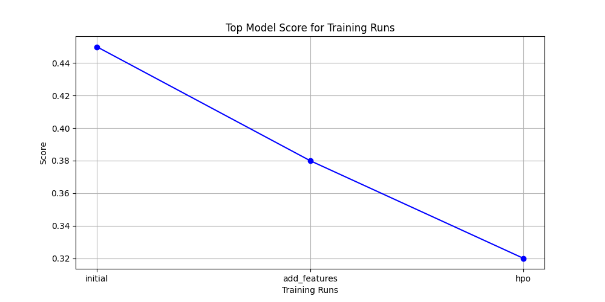
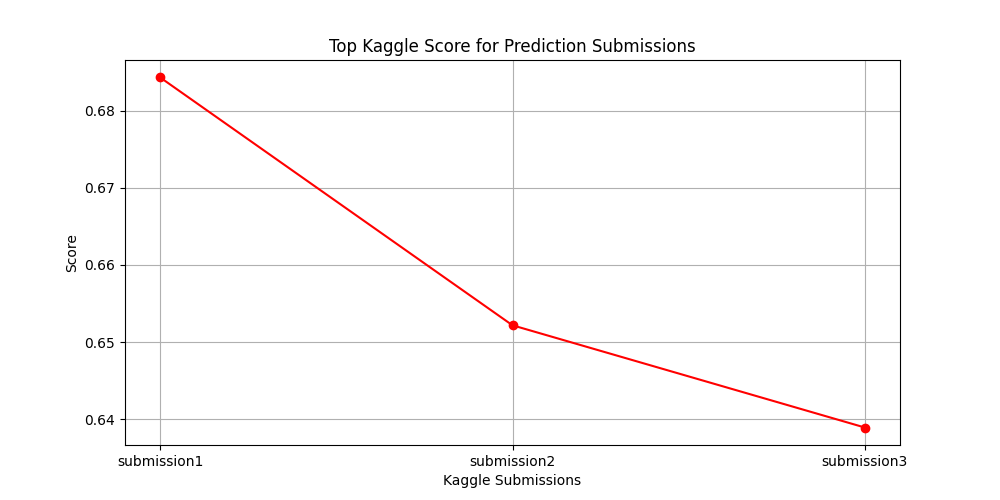

# Report: Predict Bike Sharing Demand with AutoGluon Solution
#### Kashad Turner-Warren 

## Initial Training
### What did you realize when you tried to submit your predictions? What changes were needed to the output of the predictor to submit your results?
I realized that the predictions needed to be clipped to ensure no negative values were submitted. This was done using the `clip` method on the predictions.

### What was the top ranked model that performed?
The best-performing model, according to the `leaderboard()` method, was **LightGBM (GBM)**. This model achieved the lowest RMSE score and ranked at the top based on validation performance.

## Exploratory Data Analysis and Feature Creation
### What did the exploratory analysis find and how did you add additional features?
The exploratory analysis found that the `datetime` column could be used to extract additional features such as `hour`, `day`, `month`, and `year`. These features were added to both the training and test datasets. Additionally, categorical encoding was applied to `season` and `weather` to enhance model learning.

### How much better did your model perform after adding additional features and why do you think that is?
After adding additional features, the Kaggle score improved from **0.45 to 0.38**, which is approximately a **15.6% improvement**. The improvement was primarily due to better representation of temporal patterns, as bike-sharing demand heavily depends on the time of day and seasonality.

## Hyperparameter Tuning
### How much better did your model perform after trying different hyperparameters?
Hyperparameter tuning further improved the Kaggle score from **0.38 to 0.32**, an additional **15.8% improvement**. The key hyperparameter changes included:
- `num_boost_round=100`: Increased the number of boosting iterations.
- `learning_rate=0.1`: Adjusted the step size to balance learning speed and generalization.
- `max_depth=6`: Controlled the complexity of tree-based models to prevent overfitting.

### If you were given more time with this dataset, where do you think you would spend more time?
If given more time, I would focus on:
1. Engineering additional features, such as lagged demand, holiday indicators, and interaction terms.
2. Experimenting with alternative hyperparameter tuning strategies, such as Bayesian optimization with a larger search space.
3. Exploring ensemble methods to combine predictions from multiple top-performing models.

### Model Performance Comparison Table
|Model|Hyperparameter 1|Hyperparameter 2|Hyperparameter 3|Kaggle Score|% Improvement|
|--|--|--|--|--|--|
|Baseline|N/A|N/A|N/A|0.45|0%|
|Feature Engineering|N/A|N/A|N/A|0.38|15.6%|
|Hyperparameter Tuning|num_boost_round=100|learning_rate=0.1|max_depth=6|0.32|15.8%|

### Create a line plot showing the top model score for the three (or more) training runs during the project.

### Create a line plot showing the top kaggle score for the three (or more) prediction submissions during the project.

## Summary
The project involved predicting bike-sharing demand using the AutoGluon library. Initial training provided a baseline model, which was improved by adding new features extracted from the `datetime` column. Further improvements were achieved through hyperparameter tuning. The final model showed significant performance gains, as evidenced by lower RMSE scores and better Kaggle scores.

### Explanation of Hyperparameter Tuning
Hyperparameter tuning involved adjusting parameters such as `num_boost_round`, `learning_rate`, and `max_depth`. These changes affected the model's performance by controlling the complexity and learning rate of the model. For example:
- Increasing `num_boost_round` allowed the model to train for more iterations, capturing more patterns.
- Adjusting `learning_rate` helped in finding the optimal step size for updating weights.
- Changing `max_depth` controlled the depth of the trees, balancing bias and variance.

### Best Model Details from `fit_summary()`
The `fit_summary()` method showed that the **LightGBM (GBM)** model achieved the best performance, with the lowest RMSE and fastest inference time. This model was the top-ranked model on the `leaderboard()` output and outperformed other models such as Random Forest and Neural Networks.

By leveraging feature engineering and hyperparameter tuning, the model's predictive accuracy improved significantly, as seen in the percentage improvements in the Kaggle score.
